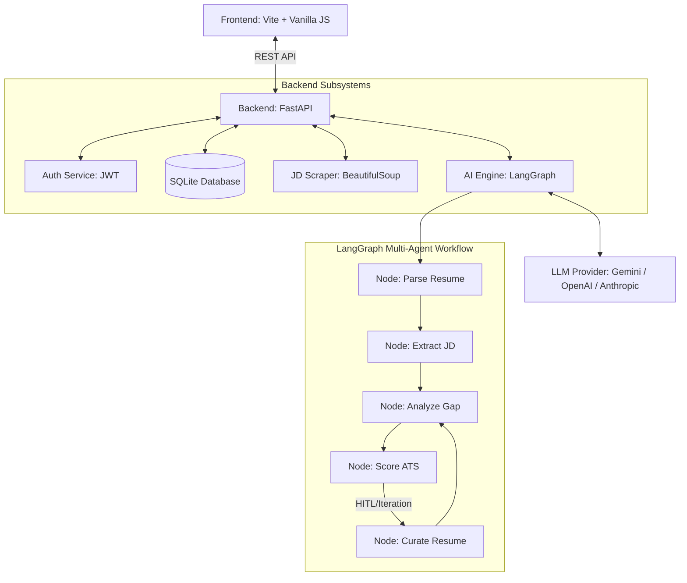
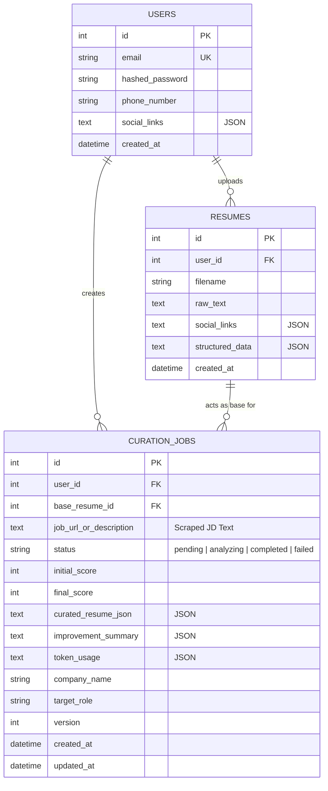

# Developer Documentation

Welcome to the **AI-Powered Employee Profile Curation** project. This document provides a high-level overview of the system architecture, the AI workflow, and the database schema to help new developers understand and contribute to the codebase.

## 🏗️ System Architecture

The application follows a modern decoupled architecture:
1.  **Frontend**: A Vanilla JavaScript Single Page Application (SPA) bundled with Vite. It handles user interactions, manages the state of the curation process (via polling), and presents the before-and-after comparator view.
2.  **Backend**: A Python FastAPI server that exposes RESTful endpoints for authentication, resume management, and curation logic.
3.  **AI Engine**: Built with LangGraph and LangChain, this multi-agent system uses multiple LLM providers (Google Gemini, OpenAI, Anthropic Claude) to parse, analyze, and iteratively curate resumes against job descriptions.
4.  **Database**: An SQLite database managed by SQLAlchemy (can be swapped for PostgreSQL in production) that stores users, resumes, and curation jobs.

## 🤖 LLM Interoperability

The backend is designed to be model-agnostic, allowing developers to switch between leading AI providers simply by updating the `backend/.env` file.

To change the active model, update the `LLM_PROVIDER` environment variable:
*   **Gemini** (Default): Set `LLM_PROVIDER=gemini` and provide `GEMINI_API_KEY`.
*   **OpenAI**: Set `LLM_PROVIDER=openai` and provide `OPENAI_API_KEY`.
*   **Anthropic**: Set `LLM_PROVIDER=anthropic` and provide `ANTHROPIC_API_KEY`.

The `backend/agents/nodes.py` script automatically instantiates the correct LangChain chat model (`ChatGoogleGenerativeAI`, `ChatOpenAI`, or `ChatAnthropic`) and the token tracking functions are compatible across all supported providers.

## 🧠 LangGraph AI Workflow

The AI engine uses a state graph to manage the curation pipeline.

1.  **parse_resume**: Converts the raw resume text into a structured JSON format (`StructuredResume`).
2.  **extract_jd**: Scrapes the job URL (if provided) and extracts core requirements and keywords (`JobRequirements`).
3.  **analyze_gap**: Compares the structured resume against the JD to find missing skills and alignment issues (`GapReport`).
4.  **score_ats**: Acts as a strict ATS system, scoring the resume from 0-100 (`ScoreReport`).
5.  **curate_resume**: (Iterative) Uses the gap report to rewrite and optimize the resume content to better match the JD without hallucinating (`CurationResult`).

The loop repeats until the score reaches 95% or the maximum iteration limit (3) is reached.

## 🗄️ Database Schema

The backend uses SQLAlchemy ORM. The following Entity-Relationship diagram outlines the core tables.

## 🛠️ Key Files & Directories

- `frontend/src/main.js`: Contains all the UI logic, API calls, and DOM manipulation.
- `backend/main.py`: The entry point for the FastAPI application and CORS configuration.
- `backend/routes/curation.py`: Handles the start, analysis, and confirmation of curation jobs. Includes the web scraper trigger.
- `backend/agents/nodes.py`: Contains the individual LangChain prompt chains and processing functions for the AI agents.
- `backend/agents/graph.py`: Wires the nodes together into the LangGraph state machine.
- `backend/models/db_models.py`: SQLAlchemy database models.
- `backend/models/state_models.py`: Pydantic models for enforcing structured JSON outputs from the LLM.
